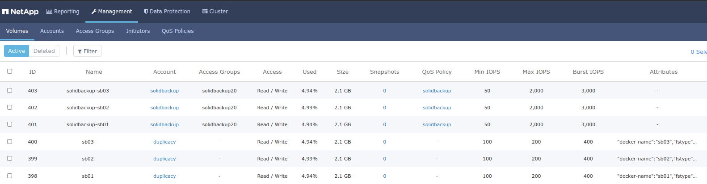
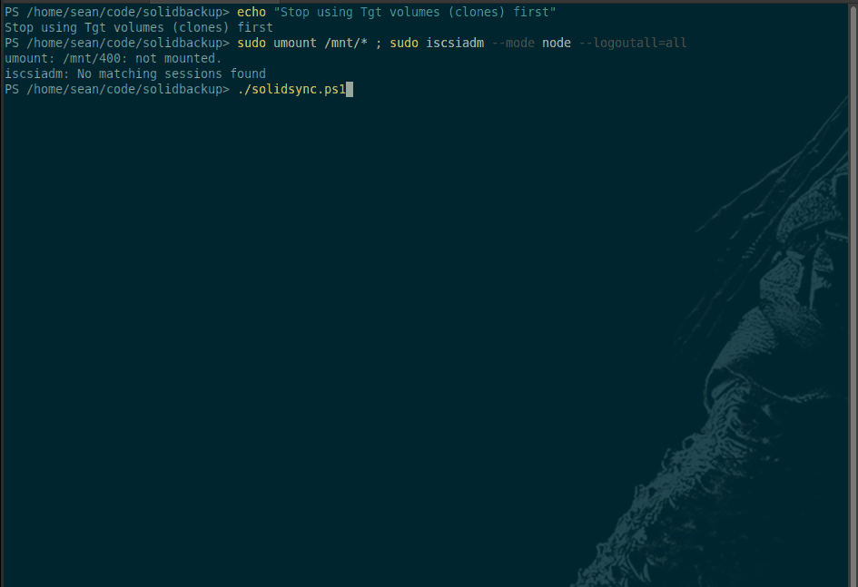
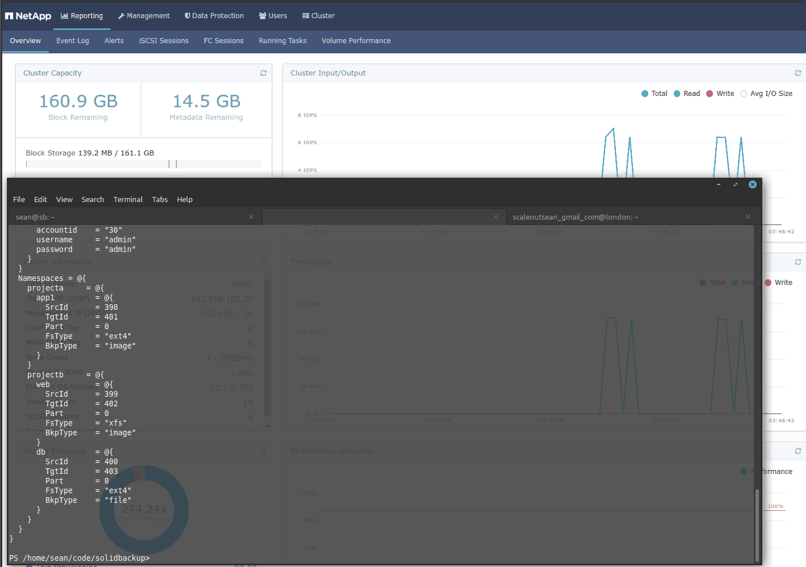

# SolidBackup

- [SolidBackup](#solidbackup)
  - [What is SolidBackup](#what-is-solidbackup)
  - [How does SolidBackup do that](#how-does-solidbackup-do-that)
  - [Is SolidBackup for you](#is-solidbackup-for-you)
  - [Install](#install)
  - [Configure](#configure)
  - [Run](#run)
    - [First time setup](#first-time-setup)
    - [Using SolidSync](#using-solidsync)
      - [Use SolidFire snapshots](#use-solidfire-snapshots)
      - [SolidSync first run](#solidsync-first-run)
      - [SolidSync subsequent runs](#solidsync-subsequent-runs)
    - [Using SolidBackup](#using-solidbackup)
      - [SolidBackup first run](#solidbackup-first-run)
      - [SolidBackup subsequent runs](#solidbackup-subsequent-runs)
  - [Limitations](#limitations)
  - [FAQs](#faqs)
    - [Doesn't this cloning take a ton of space or I/O](#doesnt-this-cloning-take-a-ton-of-space-or-io)
    - [What do I need to monitor in terms of SolidFire resources](#what-do-i-need-to-monitor-in-terms-of-solidfire-resources)
    - [Which filesystems are supported for file-based backup](#which-filesystems-are-supported-for-file-based-backup)
    - [Optimal number of backup jobs](#optimal-number-of-backup-jobs)
    - [Can I use 8 VMs to run backup to the same repository](#can-i-use-8-vms-to-run-backup-to-the-same-repository)
    - [What about NTFS filesystems](#what-about-ntfs-filesystems)
    - [How many backup repositories per each SolidFire cluster](#how-many-backup-repositories-per-each-solidfire-cluster)
    - [How can I avoid having one SolidSync or SolidBacup operator have access to all SolidFire (clone) volumes?](#how-can-i-avoid-having-one-solidsync-or-solidbacup-operator-have-access-to-all-solidfire-clone-volumes)
    - [What about ZFS and other filesystems not listed here](#what-about-zfs-and-other-filesystems-not-listed-here)
    - [What about dynamic volumes (Windows, LVM on Linux, etc)](#what-about-dynamic-volumes-windows-lvm-on-linux-etc)
    - [How do I find my backups after I've executed SolidBackup-generated backup script for Restic](#how-do-i-find-my-backups-after-ive-executed-solidbackup-generated-backup-script-for-restic)
    - [How do I automate restores](#how-do-i-automate-restores)
    - [Backup of SolidBackup configuration file(s)](#backup-of-solidbackup-configuration-files)
    - [Use SolidFire snapshots to lower the need for backup-based restores](#use-solidfire-snapshots-to-lower-the-need-for-backup-based-restores)
    - [I don't like how this or that is done, can you change it](#i-dont-like-how-this-or-that-is-done-can-you-change-it)
    - [Can you add support for ....](#can-you-add-support-for-)
    - [Can I speed up backup with SolidBackup to a local tier](#can-i-speed-up-backup-with-solidbackup-to-a-local-tier)
    - [Pull requests](#pull-requests)
  - [Gotchas](#gotchas)
    - [Stale snapshots](#stale-snapshots)
    - [Failed backup jobs](#failed-backup-jobs)
    - [Silently failed backups](#silently-failed-backups)
    - [Maxing out SolidFire metadata capacity](#maxing-out-solidfire-metadata-capacity)
    - [Maxing out SolidFire's maximum number of active or inactive volumes per node](#maxing-out-solidfires-maximum-number-of-active-or-inactive-volumes-per-node)
    - [Workload efficiency](#workload-efficiency)
    - [Encrypted volumes](#encrypted-volumes)
    - [Discard](#discard)
    - [Permissions (Ansible, Bash, filesystem mounts, PowerShell, read permissions, etc.)](#permissions-ansible-bash-filesystem-mounts-powershell-read-permissions-etc)
    - [What can one do to make this thing more secure](#what-can-one-do-to-make-this-thing-more-secure)
  - [Why the weird config file format](#why-the-weird-config-file-format)
  - [SolidBackup vs. ...](#solidbackup-vs-)
  - [What's missing](#whats-missing)

## What is SolidBackup

It's an example of data protection workflow for SolidFire storage.

If you have some PowerShell skills, SolidBackup makes it easy to:

- copy SolidFire production volumes to SolidFire backup volumes on the same SolidFire cluster, and (optionally)
- create ready-to-execute Ansible templates and backup job commands to back up cloned volumes to a destination of your choosing

Currently SolidBackup consists of two sample scripts (one of which generates other scripts) that are meant to be used or referenced by DevOps folks who know what they're doing.

Among two other SolidBackup repositories on Github (I realized this too late), only one is active - it's a [backup utility for Windows](https://github.com/dbolton/SolidBackup). I will provide links to other active repos with the same name to avoid confusion.

## How does SolidBackup do that

| Step 1                      | Step 2                     | Step 3                         | Step 4           |
| :---                        | :---                       | :---                           | :---             |
| Prepare clones, config file | SolidSync: copy Src to Tgt | SolidBacup: generate templates | Run bacukp script|
| Example: see [1]            | Example: see [2]           | Example: see [3]               | Example: see [4] |

[1] Example configuration file (with two pairs) and a screenshot of three Src-Tgt volume pairs prepared in SolidFire

```powershell
@{
  Backends = @{
    prod = @{
      name         = "SF-PROD-192.168.1.30"
      mvip         = "192.168.1.30"
      username     = "admin"
      password     = "admin"
      }
  }
  Namespaces = @{
    projecta     = @{
      app1         = @{ 
        SrcId      = 398
        TgtId      = 401
        Part       = 0
        FsType     = "ext4"
        BkpType    = "image"
      }
      app2         = @{ 
        SrcId      = 400
        TgtId      = 403
        Part       = 0
        FsType     = "xfs"
        BkpType    = "file"
      }
    }
  }
}
```



[2] Example SolidSync run



[3] Example SolidBackup run



[4] Example backup script generated by SolidBackup

- Make sure you're logged in to all iSCSI targets, and have file-based Tgt volumes mounted before you run.

```bash
#!/bin/bash
# r.env = backup repo credentials and Restic repo profile
source config/r.rc
sudo dd if=/dev/disk/by-path/ip-192.168.103.30:3260-iscsi-iqn.2010-01.com.solidfire:mn4y.solidbackup-sb01.401-lun-0 bs=256kB status=none \
    | gzip | /home/sean/bin/restic --json --verbose backup --tag src-id-398 --tag tgt-id-401 --stdin --stdin-filename mn4y.solidbackup-sb01.401.gz
sudo dd if=/dev/disk/by-path/ip-192.168.103.30:3260-iscsi-iqn.2010-01.com.solidfire:mn4y.solidbackup-sb02.402-lun-0 bs=256kB status=none \
    | gzip | /home/sean/bin/restic --json --verbose backup --tag src-id-399 --tag tgt-id-402 --stdin --stdin-filename mn4y.solidbackup-sb02.402.gz
/home/sean/bin/restic --json --verbose backup --tag src-id-400 --tag tgt-id-403 -e lost+found /mnt/400
```

- Dismount Tgt volumes, and log out of iSCSI targets after you're done

## Is SolidBackup for you

SolidSync and SolidBackup may be for you if at least one of the following is true:

- You want to regularly sync a bunch of volume pairs (Src to Tgt) for backup, DevOps or other purpose - SolidSync automates parallel execution of CopyVolume API
- You want an extra layer of defense against SolidFire volume deletion due to human error (especially in a NetApp Trident environments)
- You want to easily and non-disruptively run backup-to-S3 jobs around the clock
- You find SolidFire's Backup to S3 feature useful, but want it to work slightly differently (even if just for a handful of very volumes)

## Install

- Ubuntu 20.04 was used, but there are no known distribution or version dependencies
- Secure your VM
  - Protect the VM because intruder could get your storage credentials (you have the option to not store them on disk, but even so)
  - Close all incoming traffic except SSH from designated IPs
  - Allow outgoing HTTPS to your S3 endpoints and SolidFire management virtual IP (MVIP)
  - If you want automated execution, add backup user to passwordless sudoers (Ubuntu 20.04; if the user name is `solidbackup`, add `solidbackup ALL=(ALL) NOPASSWD: ALL` at the very *end* of file that opens when you type `sudo visudo`); if you want to run it interactively or provide password at runtime, plain sudoer may be okay
- Clone this repo
- Install PowerShell for Linux 7.1.3 or newer
- Install Restic (copy it to ~/bin of the user who will run all these scripts and add that to user's `$PATH`)
- Install parallel (`apt-get install parallel`)
- Install Ansible (version 4.0 works fine) and ansible.posix and community.general
- Modify SolidSync and and SolidBackup configuration files (below)

## Configure

- config.psd1:
  - SolidFire clusters: those are in the first section. If you don't want to hard-code the SolidFire credentials there, that's fine - just edit the scripts to get the credentials from someplace else
  - Volume pairs
    - Identified by Volume ID's (SrcId and TgtId, respectively), volume partition number (Part), filesystem (FsType) and backup type (Image or File)
    - Add Volume Pairs under any "namespace" or "app", but if you group apps under namespaces you can have like volume pairs under same app or namespace which helps with maintenance and automation. For example, if you have 500 volume pairs and cannot afford to have all those iSCSI connections active at the same time, it would be easy to use namespaces to run SolidBackup or backup scripts in stages (e.g. clone 32 pairs, bakcup, delete the clones, pick the next 32 pairs)
  - Sample config file: `config.psd1`

- Restic environment file
  - Needed by Restic to know what repo and credentials to use
  - You can source the file or - if you prefer - pass the variables in shell (see Restic documentation)
  - Sample config files (see the config directory): `r.rc` is Bash-style, `r.env` is PowerShell-style

- solidsync.ps1:
  - see configuration notes inside the script

- solidbackup.ps1
  - see configuration notes inside the script

## Run

While the current details and config files may differ, I recorded a [demo](https://www.youtube.com/watch?v=y7cFBPqdN7s) to give you an idea how this works. It's 7m30s long, and may be useul if you're a visual person.

### First time setup

- Create a "solidbackup" storage account on SolidFire - this account will be used to run SolidBackup, Ansible and backup jobs
- Create a QoS Policy called "solidbackup"
- Add volume pairs to config.psd

### Using SolidSync

#### Use SolidFire snapshots

SolidSync automatically uses a recent SolidFire snapshot to clone Source to Target, if:

- Snapshot name for the Src volume begins with `solidbackup`, and
- The snapshot is less than 24 hours old

You can obviously change the string, matching rules or max age, but the idea is to let you take short-lived (say, 4 hours) quiesced snapshots before you run SolidSync, for the sole purpose of having clones generated from application-aware snapshots.

So do whatever you do - freeze I/O, or shutdown the VM, or stop the app and unmount the FS - to get a quiesced snapshot, and then continue your work. If you name it `solidbackup-$SOMETHING` and kick off SolidSync, it will be used as source, and then - assume you didn't decided to retain it forever - expire on its own.

#### SolidSync first run

- Clone each Source volume, give it a "solidbackup-$NAME", and add required Source and Target details to a new item in config.psd1. See `prepare-clones.ps1` in the scripts directory for an example.

- SolidSync: to synchronize Src to Tgt volume pairs from config.psd1, start PowerShell and run SolidSync

```powershell
./solidsync.ps1 
```

#### SolidSync subsequent runs

- If volumes have been added or removed, add (or remove) clone volumes on SolidFire, update config.psd1, then run SolidSync as usual

### Using SolidBackup

#### SolidBackup first run

- Use `sudo iscsiadm` to discover targets (every time new volume pair(s) is added to config.psd1)
  - This and other steps need you to be a sudoer, so it is recommended to add the user to passworless sudoers (at least for the few commands you need to execute, such as iscsiadm, dd, Ansible)
- SolidBackup prepare step: logs in to iSCSI, (file-based backup only) create mount point, mount cloned volume, generate Ansible scripts, generate backup scripts
- SolidBackup execute step: at this point you just need to be logged in to iSCSI and have file-based volumes (if any) mounted.

```bash
#!/bin/bash
source config/r.rc # Restic environment variables
./restic-image-backup.sh
```

- Actual backup: sudoer permissions are required to read volume data with `dd`. Commands are saved to backup.txt but feel free to run them any way you want. Restic needs to know how to access its repo
  - After you're done, or by schedule, unmount any clone volumes' filesystem mountpooints and log out of all clone volumes' iSCSI targets
  - The SolidFire CopyVolume method used by SolidSync requires that targets be "refreshed" which means filesystem must be unmounted (if they are mounted) and iSCSI targets must be logged out

#### SolidBackup subsequent runs

- SolidBackup subsequent runs with same Src/Tgt pairs in config.psd1:
  - Run SolidSync to re-sync
  - If a volume's backup type in config.psd1 has changed from File to Image, you may need to remove Ansible filesystem mount script for the volume (find it by filename and Src Volume ID using `grep`)
  - If a volume's FS type was changed and backup type is File, you can manually edit its Ansible JSON file
  - Execute Ansible iSCSI login scripts to login to iSCSI targets, and Ansible mount scripts to mount those that should be backed up as files (see `login-and-mount.ps1` in the scripts directory; you may need to change sudoer password in the YAML files or ensure the user running these scripts is a passwordless sudoer)

- SolidBackup subsequent runs with new Src/Tgt pairs in config.psd1:
  - Run `iscsiadm` to discover new clone volumes (this could be done in SolidBackup, but because it involves a discovery and rescans with a Linux-native CLI command that aren't that easy to manage from PowerShell, it was left out)
  - Run SolidBackup

```powershell
./solidbackup.ps1 
```

## Limitations

This list isn't complete because the scripts are obviously very basic and do very little. Also, SolidBackup just build backup scripts - it doesn't do backup and restore - so one should really check the documentation and limitations of the backup utility used.

- SolidSync
  - Needs to be rewritten one more time. SolidFire API rejects new volume copy jobs if the maximum number of concurrent asynchronous jobs has been reached, and there's no super-convenient way to deal with that, but regardless, SolidlSync code should be simpler and easier to understasnd
  - There's no smart way to handle failed CopyVolume jobs (e.g. do one retry). The good news is the script logs failed CopyVolume jobs to both console and log file, and also all clone jobs are logged in SolidFire, so you can simply watch out SolidFire Events (in SNMP, Splunk, ELK, etc.) and recheck SolidSync logs if you see any issues
- SolidBackup
  - Only ext4 and XFS have been tested for File based backup and restore. ext2 and ext3 should work
  - SolidBackup needs to have few extra lines added to be able to work with partitions other than 0. NetApp Trident doesn't create partitions, and personally I don't create them for regular Linux clients either so this wasn't of big concern to me
  - There's no way to group a set of related of scripts by volume pair or otherwise. For example, if I wanted to put all Ansible scripts and backup jobs for all volumes from Namespace "accounting" (in config.psd1), or pack related scripts in 10 groups (one for all Src volumes that begin on 1, another for 2, etc.). This would be required by users who have many volumes and need to watch the number of volumes, for example

## FAQs

### Doesn't this cloning take a ton of space or I/O

No, it doesn't.

SolidFire clones are thin copies of original volumes. They only consume metadata space and the act of cloning involves copying of that data (which is < 1% of volume data; that is, we need to copy just few GB of metadata to clone a full 1TB volume).

### What do I need to monitor in terms of SolidFire resources

- Metadata space utilization - you shouldn't start to use SolidBackup if you use > 40% of MD capacity (as you'd end up consuming 80% if you cloned all volumes). Watch out for metadata capacity utilization. Most people use 10-20% of their available metadata space

- Number of iSCSI volumes (active and inactive) and connections - if you have 500 volumes and clone them all, and somehow login and stay logged in to all the 500 clones, you'd have 1,000 active connections. That's still not a bad situation (SolidFire can have 400 active per node (supported, soft limit)), but you get the idea. You could use SolidBackup with many thousands of volumes, but you'd have to backup in batches (e.g. 100 volumes in one go, then unmount and log out from clone target, then next 100 volumes). In v12.3 nactive volumes can be 700 per node (supported, soft limit)
  - It's not straightforward to see how many connections and volumes there are, but you can get iSCSI connections with `Get-SFIscsiSession`, and the number of volumes (per node) can simply be estimated from the total (e.g. 1,000 volumes over 4 nodes = 250 per node), or add up `Get-SFVolume -AccountID` for all accounts that use volumes (except SolidBackup). Active iSCSI connections can be observed by counting unique volumes in iSCSI connections (try `(Get-SFIscsiSession).TargetName`) to get an idea)

- Number of parallel backup jobs - most users won't find it beneficial to run more than 4 or 8 jobs in parallel, because you will be constrained on upload performance; the more jobs you run, the slower each job is. You can find the maximum in the documentation, I forget exactly but it could be 8 per node; although we cannot dispatch clone jobs on a per-node basis, 16 jobs should be safe on a 4 node cluster. On the one hand you don't have to worry about it as jobs will simply fail, but on the other hand if you don't retry them, backup job will backup old data... So watch SolidFire logs for rejected async jobs (which is what CopyVolume is) and decrease the parallelism in solidsync.ps1 (which could be as unscientific as adding some sleep time to a loop).

- Source-wise, one VM (such as SolidBackup) can read data from iSCSI mounts at several hundred MB/s (if you have just 4 volumes set to Max (4kB) IOPS of 50,000, for example). See [this video](https://www.youtube.com/watch?v=SCzk3ZpfT-Y) for an example of SolidFire backup performance with multiple "backup VMs" reading data off SolidFire. Slowdowns in SolidBackup environment may happen because of the way backup utility accesses data, compression, and other factors - it is very unlikely that the speed of iSCSI access will be your limiting factor. Image-style volume backups are wasteful so they will perform full read on every backup even if nothing has changed, but you'll still see 100-200 MB/s per volume.

### Which filesystems are supported for file-based backup

Any you can make work!

Right now SolidBackup accepts ext2, ext3, ext4, xfs, while it complains about BTRFS, ZFS, NTFS. NTFS on Linux should be able to work in at least basic NTFS scenarios, but I have no need or time to test it.

Feel free to give it a try. You can always fall back to the Image backup mode if you can't, or try to improve the script.

### Optimal number of backup jobs

I'd start with one at a time (as per `./restic-image-backup.sh`) until I make sure I have no errors and only try to run in parallel if one at a time is not enough.

### Can I use 8 VMs to run backup to the same repository

With most utilities, you shouldn't, because one node may prune data required by another node. See Restic (or other) documentation.

### What about NTFS filesystems

For NTFS filesystems, install NTFS driver package for Linux and give it a try (both backup *and* restore). Then change SolidBackup to not complain about NTFS.

Or put all NTFS volume pairs under into the "Windows" namespace (in config.psd1) and modify SolidBackup to create Windows-only backup script and execute it using Restic for Windows (run it in a Windows VM, and use a dedicated Restic backup respository).

### How many backup repositories per each SolidFire cluster

One is good, if your SolidBackup VM is one, and it can complete job in time.

If it can't, or if you need several, use additioanl backup repositories per cluster (that will decrease efficiency with Restic, as there's no cross-repository deduplication).

### How can I avoid having one SolidSync or SolidBacup operator have access to all SolidFire (clone) volumes?

You can create several backup repositories and run several SolidBackup instances one per team or department, each completely independent of each other. In this case I would create a dedicated SolidFire cluster admin account for each SolidBackup operator so that at least you know which admin did what.

Each application owner could simply use Restic and avoid the need for SolidSync and SolidBackup.

It appears it's best to have as few repositories as possible, use file-based backup, and encourage users to encrypt sensitive data (such as database columns or tables) so that file-based backup becomes feasible, and use image-style backup on encrypted smaller volumes with data that cannot be encrypted).

### What about ZFS and other filesystems not listed here

There are ...challenges with automating those.

Some (like ZFS) have its own backup/restore utilities, so you should probably consider those first.

Other than that, try to check latest community resources - maybe there's an established procedure that works.

### What about dynamic volumes (Windows, LVM on Linux, etc)

Same as ZFS: it can be done, but I won't do it. You can try to make it work, or switch to image-style backup.

SolidFire supports Group Snapshots, so if all participating volumes are quiesced and snapshot as a group, SolidSync can use that snapshot to copy Source to Target volumes, and then group-consistent Image backup can be taken and facilitate the re-assembly of dynamic volume after image restore.

### How do I find my backups after I've executed SolidBackup-generated backup script for Restic

Whether you're at the same or different computer, you need to pass repository variables and authenticate against. Let's say I use `r.env`. As mentioend elsewhere on this page, if you're restoring on somebody's computer, you must be very careful about (not) leaving repository details in your shell history, etc. which is why it is suggested to restore files within a temporary secure VM that's accessible only to you (see "How do I automate restores").

```shell
$ source r.env
$ restic snapshots
repository 9f88ba35 opened successfully, password is correct
ID        Time                 Host        Tags                   Paths
-----------------------------------------------------------------------------------------------
b718ec5c  2021-06-02 03:27:19  sb          src-id-400,tgt-id-403  /mnt/400
177b84f9  2021-06-02 03:37:01  sb          src-id-398,tgt-id-401  /mn4y.solidbackup-sb01.401.gz
d9de22f9  2021-06-02 05:10:59  sb          src-id-398,tgt-id-401  /mn4y.solidbackup-sb01.401.gz
b537573b  2021-06-02 05:11:00  sb          src-id-399,tgt-id-402  /mn4y.solidbackup-sb02.402.gz
2657b54e  2021-06-02 05:13:15  sb          src-id-400,tgt-id-403  /mnt/400
-----------------------------------------------------------------------------------------------
5 snapshots
```

Examples:

- To restore file-based backup from latest backup snapshot for /mnt/400:
`restic restore 2657b54e --target /tmp/file-restore`. Find the file(s) in /tmp/file-restore/mnt/400 directory

- To restore latest image-based backup for Tgt Volume Id 401: 
`restic restore d9de22f9 --target /tmp/image-restore/`. Then unzip (gunzip, gzip -d) the file and write it to a block device

- To find the latest backup for Source Volume ID 388 (notice there are two, 177b84f9 and d9de22f9):

```sh
$ restic snapshots --tag src-id-398 --last
repository 9f88ba35 opened successfully, password is correct
ID        Time                 Host        Tags                   Paths
-----------------------------------------------------------------------------------------------
d9de22f9  2021-06-02 05:10:59  sb          src-id-398,tgt-id-401  /mn4y.solidbackup-sb01.401.gz
-----------------------------------------------------------------------------------------------
1 snapshots
```

For more see the docs of the backup utility you use (in this case it's obviously Restic).

### How do I automate restores

If the question is how to restore an entire Target (clone) volume image, you can simply stop using the Source, log out from iSCSI target (Source), and use Copy Volume in the opposite direction, to copy Target to Source. This assumes that Target (clone of Source) is at least as recent, or more recent, that what you have in backup repository. But you should always have snapshots (not backups).

Then you can log back into the iSCSI Target and mount the volume. You should see the data that the volume had the last time SolidSync executed. A safer way would be to clone Target volume into a *new* volume, present it to a *fresh temporary VM*, and let the application owner use a special temporary account to see if they want to use that volume, and only then overwrite the Source as I just explained (feel free to take a snapshot of the Source volume for additional protection). You could also just copy selected files from this temporary VM.

Key is, you have to be careful about backup credentials and (image-backup restore) presenting the 2nd bit-for-bit identical volume to iSCSI client.

File restores can be done directly to another directory on SolidBackup VM, the Source VM/server, or to a temporary VM. Unless the files are many or large, it's better to restore them to a temporary VM because this way is more secure for the backup admin who needs to run Restic (or other) client in the VM.

If the question is how to automate restore from backup repository directly to the Source volume, I don't think that is desirable because:

- You already have a copy of your production data (Target, i.e. Clone Volume)
- SolidBackup VM is not meant to access Source Volume (to be able to restore backup data to it)
- To restore volume *image* from backup repository, the admin can set up ad-hoc VM and run restore-from-repo from within the VM (there's no need to use SolidBackup VM for that - it should be isolated and secure)
- If you lose a lot of volumes, that probably means you've lost the SolidFire cluster and you don't even know who owns which volume, how big each volume is, etc. That is why config.psd1 should be backed up as well

It isn't hard to automate restores: SolidBackup has tags which keep record of Source and Target Volume IDs, so if you "simply" get a list of snapshots and select the most recent one, you will have the Source and Target ID, filename (image backup) or mount point (file backup) and as long as either Source or Target volumes exist, you know the size, and from config.psd1 you have the filesystem and partition number. Then can create a new volume and restore image backup to it. For file-based backups it's much easier - you can restore them anywhere, and you can also mount S3 backup using Restic.

### Backup of SolidBackup configuration file(s)

You need a way to know which Target volume ID maps to which Source volume ID, application, what filesystem was used, and how large the volume is (especially for image-based restores as such backups should not be restored to smaller size volumes).

config.psd1 doesn't contain volume size (in bytes), but the rest of the information (Src Vol Id, Tgt Vol Id, filesystem type, etc) is in there. Maybe consider making a backup of the entire VM, or use File-based backup and backup a directory with config.psd1 and output of `Get-SFVolume` to have the idea about volume sizes. You will not be able to decrypt backup data without Restic credentials, so rehearse the entire workflow to be ready for Disaster Recovery.

### Use SolidFire snapshots to lower the need for backup-based restores

SolidFire can take up to 32 snapshots per volume.

We can create a snapshot schedule that takes crash-consistent snapshot of the volume every (say) 15 minutes and keeps it 2 hours. Or something that suits you better, e.g. one every 5 minutes, retain 3, and one every 30 minutes, retain two.

In any case, snapshots may eliminate the need to restore from backups, as long as the volume exists (if you delete and purge the volume, then you'd have to restore from backup).

### I don't like how this or that is done, can you change it

Please change it by yourself if you can, or reach out to NetApp PS or other skilled professionals.

### Can you add support for ....

Please add it by yourself if you can, or reach out to NetApp PS or other skilled professionals.

As far as other backup utilities are concerned, I've created "SolidBackup" demos with Duplicacy and Duplicati and for the latter there is a [YouTube video](https://www.youtube.com/watch?v=9O3wXeD51IU) in which you can see how easy it is to use the Web UI to generate CLI commands for Duplicati. Maybe that can save you time to come up with the CLI backup command, although it's probably best to simply read their CLI or API (if they have it) documentation.

### Can I speed up backup with SolidBackup to a local tier

You can backup to a local S3 object store such as NetApp StorageGRID, and configure StorageGRID to replicate backup bucket to a remote S3 object store.

### Pull requests

Please submit against the `develop` branch).

I can't guarantee I'll add it (if it's something along the lines of things from What's Missing section below, it's more likely), but pull requests are welcome, especially if switches are added so that users can opt-out of features.

## Gotchas

### Stale snapshots

By default the script skips source volume snapshots older than 1 day; tricky part is if you restore a volume, your next backup may be invalid. It is therefore recommended to create snapshots named `solidbackup-$SOMETHING` with limited retention (say, 120 minutes) which should be retained long enough for SolidSync jobs to finish.

### Failed backup jobs

If iSCSI login fails, or filesystem mount fails (maybe you wrote it's XFS, but it's ext4), backup job may fail, or (even worse) backup nothing (in the case nothing gets mounted under /mnt/400, you'll get a backup, but it will be empty).

That's why SolidBackup creates Ansible files for you, so that you can login to targets, mount filesystems (where necessary) and easily track if you get any errors along the way.

You could add additional and/or custom checks via Ansible to be even safer.

Every time config.psd1 changes, run Ansible manually once to make sure it works. Later you don't need to watch it too closely - just make sure you watch the Ansible logs for errors.

### Silently failed backups

Say you somehow didn't mount a filesystem, or mounted it but couldn't read data from it.

SolidBackup just copies volumes. You can always mount a SolidBackup Tgt (Clone) volume in a separate host and validate it corresponds to the Source volume or its Snapshot from which it was created.

The rest is up to you. Backups are done by you (and Restic or whatever you use). Please occasionally verify your backups. Restic cannot perform logical validation for you. Once a month or week get a spare VM or container, restore a volume or file and see if restored data are okay. This can be easily automated, especially for File backup.

Keep restic logs, and yet better, collect them in one place and parse them for errors.

### Maxing out SolidFire metadata capacity

Because volume clones don't take up any SolidFire data capacity, only metadata does. The SolidBackup script checks for metadata utilization and stops if it's > 40% (of course, you can remove that part of the code if you want).

In the SolidFire UI, metadata fullness can be seen in the top left corner of the home page.

### Maxing out SolidFire's maximum number of active or inactive volumes per node

You'd need to have 000's of volumes to have to worry about that. I'd create multiple config.psd1 files, or (with just one config.psd1) multiple SolidBackup VMs, and run backup on a set of 200 volumes at one time.

But if you do worry about that, watch those indicators with HCI Collector or solidfire-exporter or use your own method.

### Workload efficiency

If VMs, containers or physical hosts do not discard deleted blocks, volume (image) backups will contain junk.

- File backup: Target (Clone) volumes are mounted read-only, so discarded blocks are never backed up, or restored (or sent to/from S3)
- Image backup: you get all the junk found in the volume, unless it was discarded before backup. But your backup is byte-for-byte identical with the Target (Clone)

We could mount Target volume specified for Image backup, discard deleted blocks from it, unmount it and then backup the volume as image, but that would go against one of core principles of SolidBackup ("don't touch a damn thing"). Also it's mentally exhausting - lot more I/O to handle, responsibility if restores fail, etc. Get data owners to trim their FS data and take SolidBackup snapshots after such operations (if possible).

### Encrypted volumes

If you have users who must encrypt volumes, check if Image backup makes more sense for them.

Because volume encryption is quite wasteful and inefficient for backup, in some cases it might make sense to encrypt application data (e.g. database, or database tables or columns) instead and backup encrypted files.

If you have compliance requirements, I would suggest to buy commercial backup software.

### Discard

Image backup backs up un-discarded filesystem blocks. To save resources, have your Source volumes mounted with `discard`, or run `fstrim` before you take a snapshot and run SolidSync, or switch to using file-based backup.

### Permissions (Ansible, Bash, filesystem mounts, PowerShell, read permissions, etc.)

I add the user who runs backup to passwordless sudoers and make restic able to read all data. That works for the scenarios I've tried (image and file backup), but you need to properly secure the VM.

I have not tried to create files on the Src volume that only the root user can read. I expect I would need to run `sudo restic backup` to take a File-style backup of the mounted clone (Tgt) volume, but then shell variables wouldn't work as-is. If you look at the script, volumes are backed up with `sudo dd` but that's piped to backup utility that runs as regular user. File backup, on the other hand, works without sudo, but I'm not sure it always can read all the files.

If you hit a problem, try to experiment by running backup manually, and modify the script once you figure it out. There's certainly no problem with running backup as sudoer, but Restic and Ansible environment variables (now loaded from user-specific files) would have to be passed from the script or shell which some see as less secure (supposedly root could see your backup repository or SolidFire credentials; but as mentioned earlier you aren't supposed to have anyone but trusted users access this VM).

### What can one do to make this thing more secure

- Secure SolidBackup VM as you would secure SolidFire Management Node (first and foremost, do not expose that VM to VM Network - keep it on Backup or Management network(s); access to it should be limited to Administrators)
- You can encrypt the disks with LUKS
- SolidBackup VM doesn't need any incoming ports except SSH (you could run it from vCenter Console if you wanted to)
  - For added security, disable password authentication for SSH (use public key authentication)
- Set up log forwarding to Splunk, ELK or whatever, and closely watch login & security logs

## Why the weird config file format

When I wrote SolidBackup "alpha" I used in Python and configparser and that was nice. But at the same time I ended up spending way too much time on the TUI (CRUD) which in turn made me realize that won't work for many volumes.

Later I revisited this project and after trying out CSV, SQL and other approaches I settled for the present config file format which I used in a script that sets up replication and failover between SolidFire storage clusters in a Trident / Kubernetes environment.

I haven't finished that Kubernetes script yet, but I think this config file is fine. That's why there are namespaces and apps in it. I figure it's not worse than CSV and it may make it easier to use SolidBackup to backup SolidFire in Kubernetes and other environments.

## SolidBackup vs. ...

There's no "versus" - SolidBackup just copies volumes, it's not a backup utility. Which backup utility you want to use and how is entirely up to you.

I will spend some time on one particular scenario, though - SolidBackup vs. SolidFire Backup (to S3) - because the both are simple, have basic features, do not require the purchase of additional software and because I'd only ever recommend SolidBackup as a replacement (or complementary solution) for SolidFire Backup to S3 and not over any commercial backup software or service.

| Detail             | SF Backup (to S3)| SB        | Note  |
| :---               | :---             | :---      | :---  |
| Hands-off, built-in| Yes              | No        | Can be easily consumed via the SF API |
| Customization      | No               | Yes       | Downside of "hands-off, built-in" above |
| Security           | unencrypted      | encrypted | SB needs a secured client-side OS [1] |
| S3 space & bandwidth efficiency       | intra-Volume | it depends | See [2] |
| Tags               | basic            | advanced  | see [3] |
| Manageability      | basic            | advanced  | see [4] |
| Local efficiency (img backup) | high  | intermediate | see [5] |
| Local efficiency (file backup)| -     | high      | see [6] |
| Hybrid cloud       | No               | Yes       | see [7] |
| Restore to any SF cluster | Yes       | Yes       | Backups from one SolidFire cluster can be restored to another |
| Containers/K8s integration| basic     | intermediate | see [8] |
| Backup performance | fixed            | flexible  | see [9] |
| Local efficiency (cluster resources)| high | low  | see [10] |
| Application-consistent backup | hard  | easy      | If you can create application-consistent snapshot, SolidSync will clone from that snapshot. See [11] |

[1] SolidSync and SolidBackup need additional effort to secure OS used to run the scripts

[2] SolidBackup doesn't encrypt; backup utility it uses does. If you use Restic, as in first implementation, you get compression and cross-volume deduplication, but deduplication is coarse (not like SolidFire's 4kB granularity). Overall though, because of cross-job and cross-volume efficiencies and other reasons (such as the ability to resume interrupted backup jobs), SolidBackup with 3rd party backup utilities should get better results (meaning, less bandwidht and less S3 space required) overall. 

[3] While SolidFire Backup to S3 supports tags, it's mostly for backup and it's less useful in restore and backup management.

[4] Because SB is a DIY solution, you can do whatever you fancy (for example, change Restic with another engine). SF Backup's biggest advantage is integration in the SolidFire UI, log/event system and "time remaining" metric is available in the UI and via the API.

[5] Let's ignore *file-based* backup because SolidFire backup to S3 doesn't use it. For *image* backup, both approaches read entire volume contents, but SolidFire Backup to S3 uses less compute resources as it runs from SolidFire storage nodes. If you completely emulate SolidFire's Backup to S3 by using SolidBackup fo rimage backup, you'll read the same amount of iSCSI volume data and use network bandwidth to hypervisor/VM.

[6] Assuming you can mount the clone file system (should be fine for ext2, ext3, xfs, and NTFS (maybe in Linux, but certainly in Windows, if you set up a Windows VM)), backup efficiency of SolidBackup is high. Instead of reading the entire 50 GB volume and backing up whatever you find it in, you read the files *you want* (others may be excluded) so instead of backing up 40 GB (even if it gets compressed down to 20 GB), you can backup 10 GB of DB files and compress them to 5 GB. And restore them some 10% of the time (5 GB vs. 40 GB)

[7] If you want to move your workload to cloud, just restore SolidBackup backups to equally sized iSCSI device (image backup) or like filesystem or direct-to-application (file-based backup). If you want to repatriate your workload from the cloud, just restore it onto new SolidFire volume or filesystem as you normally would. SolidFire can replicate data to Cloud Volumes ONTAP asynchronously via SnapMirror (similar to, but not quite, "backup").

[8] NetApp Trident uses unpartitioned volumes (e.g. entire disks are formatted with ext4, ext3, or xfs). SolidFire Backup to S3 is image-based backup so it doesn't care about that, but SolidBackup can go one step ahead and (a) use advanced tagging to tag backups with K8s- or Docker-related tags (this would require such tags to be fetched and added to backup scripts), and (b) Velero backup can backup and restore generic K8s volumes using Restic so it may be possible to restore Restic backups from VMs to containers and vice versa (needs to be evaluated), and (c) there is potential for upload bandwidth saving and S3 capacity saving if the same repo is used by SolidBackup and Restic (also needs to be evaluated). Another detail worth mention is currently NetApp Trident purge-deletes PVs, which means you can't use the usual "recover volume" SolidFire feature. But if you used SolidSync to create a clone volume, you can create a new volume and copy clone to new volume, thereby recovering its contents in seconds.

[9] Based on my experience SolidFire's Backup to S3 obeys the volume's QoS settings (whatever they are). SolidSync uses a custom QoS policy on the clones, so you can get a high Max/Burst performance without setting (pre-backup) and resetting (post-backup) QoS on original volumes

[10] By default, SolidBackup creates clones and keeps them around. That means, unless you change the script to make it work in batches and/or create new clones every time, a cluster with 1,000 volumes will have 1,000 clones lying around, and (thanks to 2x the amount of volumes) consume 2x as much SolidFire metadata space. So as-is, SolidBackup will consume 2x metadata space, 2x inactive volumes, and (during backup) 2x active volumes. SolidBackup could be changed to use less resources, but by default it doesn't because usually this won't be a problem. Incrased active volume connections are the easiest to address as backup commands can be executed in batches with only minor changes to SolidBackup script (to not run Ansible and let the admin run it just-in-time before each backup job).

[11] If you can shutdown or suspend (freeze) your workloads when you initiate SolidSync on the Source volume, you'll get an application-consistent clone. But if you have 300 volumes, it may take 10 minutes for the last CopyVolume job to get dispatched. You could add another volume to each app, and dump (backup) app data to it, which would work fine with both Backup to S3 and SolidSync, but it would increase capacity utilization so E-Series iSCSI storage would be better for this "D2D" approach. For a live application without extra disks, if you can freeze it at 11:49:50 and initiate a SolidFire snapshot at 11:50:00, you can SolidSync it later (as long as your snapshot age is lower than the max set in SolidSync, and that figure can be changed.)

## What's missing

A lot, of course. But this is just a starting point for your customization, not a final product.

SolidSync and SolidBackup aim to be bare-bones, simple and generic. 

Some things that I'd like to see improved: 

- Rewrite SolidSync to be simpler
- For SolidSync and SolidBackup, define input parameters and switches to avoid hard-coded configuration values
- Scripted interface for the mainteance of the SolidBakcup config file: config.psd1 is hard to edit, also mountpoints in /mnt/ as well as Ansible JSON files need to be removed as volume pairs are removed from the config file to avoid manual maintenance of config file.
- Function to analyze logs and create reports of SolidSync and SolidBackup runs
- Log and metrics forwarding for SolidSync and SolidBackup: this is relatively easy (to send sync job details to Elastic and such)
- Switch for the choice of backup utility so that we can generate jobs for other popular backup utilities
- Once both SolidSync and SolidBackup better organized, turn them into one PowerShell module(s)
